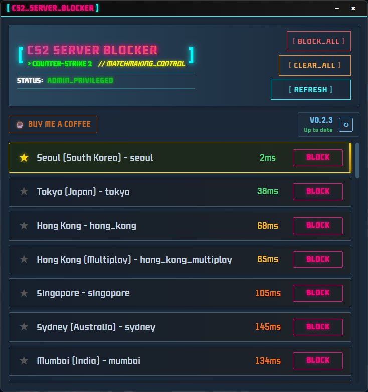

# Counter Strike 2 サーバーブロッカー

*他の言語で読む: [English](README.md), [한국어](README_KR.md)*

------

### ゲームを再起動することなく、不要なサーバーをブロックできるシンプルなCS2サーバーブロッカープログラムです。

## ダウンロード

--- 

### [リリース](https://github.com/devsepnine/cs2-server-blocker-p/releases)

## スクリーンショット

---

## 動作環境

---

- Windows OS

## ? よくある質問

---
- どのように動作し、ゲームでバンされる可能性はありますか？
  - このプログラムはCS2のゲームファイルやシステムファイルを操作せず、単純にファイアウォールポリシーを変更してサーバー接続をブロックするプログラムです。
- なぜ管理者権限が必要ですか？
  - ファイアウォールポリシーにはWindows管理者権限が必要です。通常モードではサーバーブロックを実行できないため、管理者権限が必要です。

## プロジェクトサポート

---

