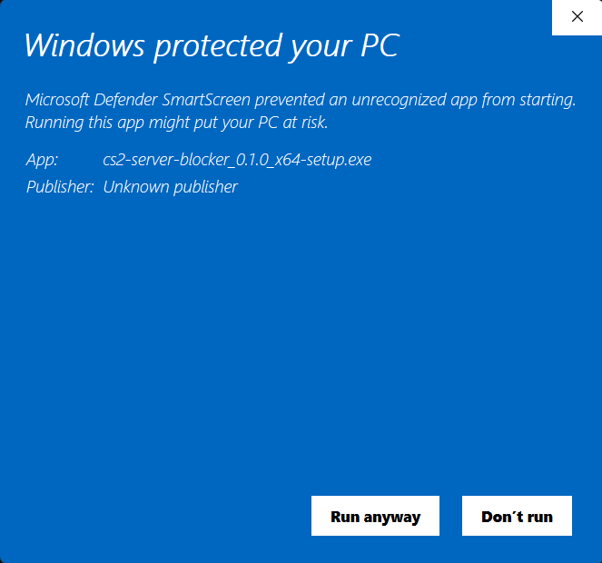

# CS2 サーバーブロッカー (CS2 Server Blocker)

#### 他の言語で読む: [English](README.md), [한국어](README_KR.md)

--- 

#### ゲームを再起動する面倒なく、数クリックで不要なサーバーをブロックしましょう！

#### シンプルで直感的なCS2サーバーブロッキングプログラムをご紹介します。このプログラムを使用すると、特定の地域や高pingのサーバーを避けて、快適な環境でゲームを楽しむことができます。

# ダウンロード (Download)

---

## [リリース](https://github.com/devsepnine/cs2-server-blocker-p/releases)

# スクリーンショット (Screenshot)

---

# 動作環境 (Requirements)

---

    Windows オペレーティングシステム (Windows 10以上推奨)

# よくある質問 (FAQ)

---

Q. どのように動作しますか？ゲームでバンされるリスクはありませんか？

A. このプログラムは、Windowsに内蔵されているファイアウォール機能を利用して、特定のサーバーIPアドレスへの接続をブロックする仕組みで動作します。CS2のゲームファイル、プロセス、メモリを一切変更したり触れたりしません。

したがって、ValveのアンチチートシステムであるVACに検出される心配はなく、ゲームバンのリスクなしに安心してご利用いただけます。

Q. なぜ管理者権限が必要ですか？

A. Windowsファイアウォールルールの追加や変更は、システム全体のネットワークセキュリティに影響を与える可能性のある機密性の高い作業です。そのため、Windowsオペレーティングシステムは、このような変更作業を実行する際に必ず管理者権限を要求します。このプログラムはファイアウォールルールを制御する必要があるため、正常な動作のために管理者権限で実行される必要があります。

Q. 「WindowsによってPCが保護されました」というSmartScreen警告が表示されます。安全ですか？

A. はい、安全です。Microsoftは、正式に登録された開発者（パブリッシャー）でない、またはよく知られていないプログラムが実行される際に、このような警告を表示します。

正式にアプリを配布するためには、開発者が費用を支払い、「コード署名証明書」を取得してプログラムに署名する必要があります。このプログラムは個人開発者が作成した無料のオープンソースプログラムなので、別途署名されておらず警告が表示されます。

以下のように「詳細情報」をクリックした後、「実行」ボタンを押してプログラムを開始できます。

# プロジェクトサポート (Support Project)

---

このプログラムが役に立ったなら、コーヒー一杯で開発者を応援してください！皆様の小さなサポートが、プロジェクトを維持し発展させる大きな力になります。

