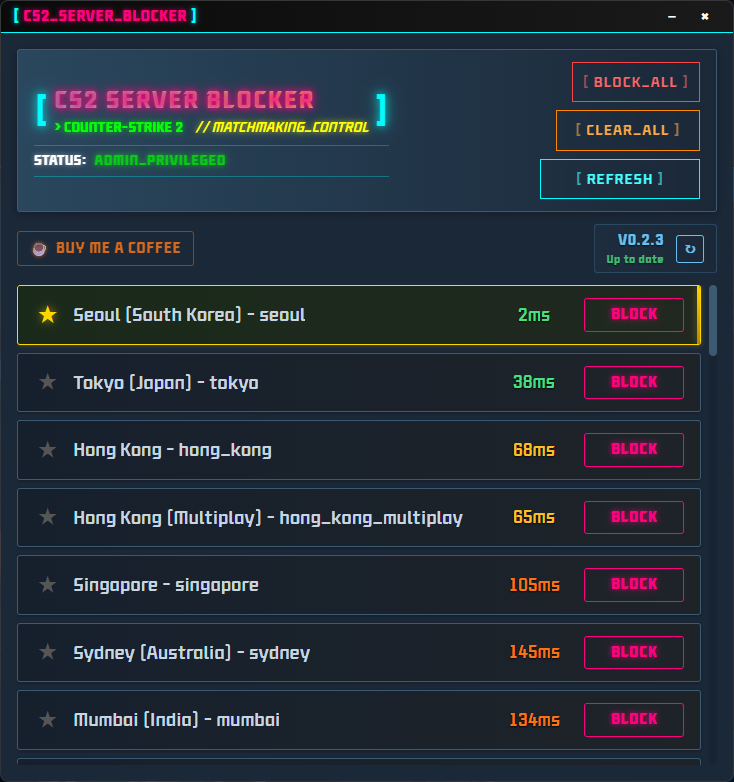
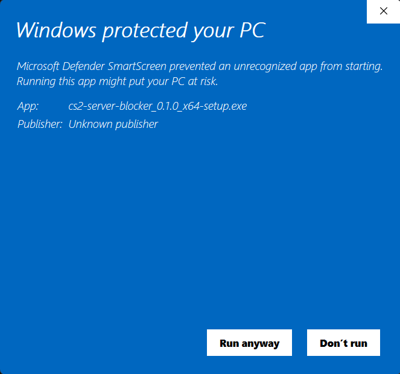

# CS2 서버 차단기 (CS2 Server Blocker)

#### 다른 언어로 읽기: [English](README.md), [日本語](README_JP.md)

--- 

#### 게임을 재시작하는 번거로움 없이, 클릭 몇 번으로 원하지 않는 서버를 차단하세요!

#### 간단하고 직관적인 CS2 서버 차단 프로그램을 소개합니다. 이 프로그램을 사용하면 특정 지역이나 핑이 높은 서버를 피해 쾌적한 환경에서 게임을 즐길 수 있습니다.

# 다운로드 (Download)

---

## [Release](https://github.com/devsepnine/cs2-server-blocker-p/releases)

# 스크린샷 (Screenshot)

---

# 요구사항 (Requirements)

---

    Windows 운영체제 (Windows 10 이상 권장)

# 자주 묻는 질문 (FAQ)

---

Q. 어떻게 작동하나요? 게임 이용 제재(밴)를 당할 위험은 없나요?

A. 이 프로그램은 Windows에 내장된 방화벽 기능을 이용하여 특정 서버 IP 주소로의 연결을 차단하는 원리로 동작합니다. CS2 게임 파일, 프로세스, 메모리를 전혀 수정하거나 건드리지 않습니다.

따라서 Valve의 안티 치트(VAC) 시스템에 감지될 우려가 없으며, 게임 이용 제재(밴)의 위험 없이 안심하고 사용하셔도 좋습니다.

Q. 왜 관리자 권한이 필요한가요?

A. Windows 방화벽 규칙을 추가하거나 수정하는 작업은 시스템 전체의 네트워크 보안에 영향을 미칠 수 있는 민감한 작업입니다. 따라서 Windows 운영체제는 이러한 변경 작업을 수행할 때 반드시 관리자 권한을 요구합니다. 이 프로그램은 방화벽 규칙을 제어해야 하므로, 정상적인 작동을 위해 관리자 권한으로 실행되어야 합니다.

Q. "Windows의 PC 보호" 라는 SmartScreen 경고 창이 뜹니다. 안전한가요?

A. 네, 안전합니다. Microsoft는 공식적으로 등록된 개발자(게시자)가 아니거나, 잘 알려지지 않은 프로그램이 실행될 때 이와 같은 경고를 표시합니다.

정식으로 앱을 배포하기 위해서는 개발자가 비용을 지불하고 '코드 서명 인증서'를 발급받아 프로그램에 서명해야 합니다. 이 프로그램은 개인 개발자가 만든 무료 오픈소스 프로그램이므로 별도의 서명이 되어있지 않아 경고가 표시됩니다.

아래와 같이 '추가 정보'를 클릭하신 후 '실행' 버튼을 눌러 프로그램을 시작할 수 있습니다.

# 프로젝트 후원하기 (Support Project)

---

이 프로그램이 유용하셨다면, 커피 한 잔으로 개발자를 응원해주세요! 여러분의 작은 후원이 프로젝트를 유지하고 발전시키는 데 큰 힘이 됩니다.

